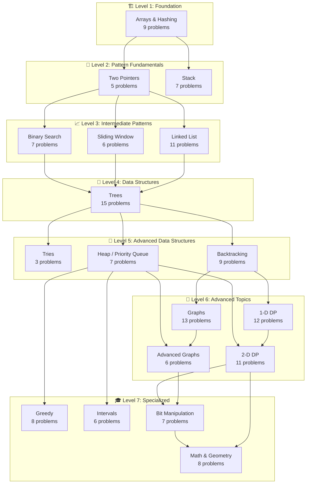

# 🗺️ DSA Learning Roadmap

> [!info] How to Use This Roadmap
> This roadmap follows **NeetCode's progressive learning path**. Topics are ordered by **prerequisite dependencies**, building from foundational concepts to advanced techniques. Start with **Arrays & Hashing** and work your way through each level.
>
> **Status Legend:** ⬜ Not Started | ⏳ Queued | 🔄 In Progress | ✅ Completed | ⭐ Review Needed
> 
> **Difficulty:** 🟢 Easy | 🟡 Medium | 🔴 Hard
> 
> **Priority:** 🔥 Must Know | ⚡ Common Interview | 💡 Good Practice

---

## 📊 Progress Overview

| Metric | Count |
|--------|-------|
| **Total Problems** | 150 |
| **Completed** | 0/150 (0%) |
| **Current Focus** | [[#Arrays & Hashing]] |

### Level Progress
| Level | Topics | Status |
|-------|--------|--------|
| 🏗️ Foundation | Arrays & Hashing | ⬜ 0/9 |
| 🎯 Pattern Fundamentals | Two Pointers, Stack | ⬜ 0/12 |
| 📈 Intermediate Patterns | Binary Search, Sliding Window, Linked List | ⬜ 0/24 |
| 🌳 Data Structures | Trees | ⬜ 0/15 |
| 🧩 Advanced DS | Tries, Backtracking, Heap | ⬜ 0/17 |
| 🚀 Advanced Topics | Graphs, 1-D DP, Advanced Graphs, 2-D DP | ⬜ 0/43 |
| 🎓 Specialized | Greedy, Intervals, Bit Manipulation, Math & Geometry | ⬜ 0/29 |

---

## 🗺️ Visual Roadmap



---

## 📑 Table of Contents

### Foundation
1. [[#Arrays & Hashing]] - Level 1 (9 problems)

### Pattern Fundamentals  
2. [[#Two Pointers]] - Level 2 (5 problems)
3. [[#Stack]] - Level 2 (7 problems)

### Intermediate Patterns
4. [[#Binary Search]] - Level 3 (7 problems)
5. [[#Sliding Window]] - Level 3 (6 problems)
6. [[#Linked List]] - Level 3 (11 problems)

### Data Structures
7. [[#Trees]] - Level 4 (15 problems)

### Advanced Data Structures
8. [[#Tries]] - Level 5 (3 problems)
9. [[#Backtracking]] - Level 5 (9 problems)
10. [[#Heap / Priority Queue]] - Level 5 (7 problems)

### Advanced Topics
11. [[#Graphs]] - Level 6 (13 problems)
12. [[#1-D Dynamic Programming]] - Level 6 (12 problems)
13. [[#Advanced Graphs]] - Level 6 (6 problems)
14. [[#2-D Dynamic Programming]] - Level 6 (11 problems)

### Specialized Topics
15. [[#Greedy]] - Level 7 (8 problems)
16. [[#Intervals]] - Level 7 (6 problems)
17. [[#Bit Manipulation]] - Level 7 (7 problems)
18. [[#Math & Geometry]] - Level 7 (8 problems)

---

# 🏗️ Level 1: Foundation

---

## Arrays & Hashing

**Prerequisites**: None — Start here! 🚀
**Leads To**: [[#Two Pointers]], [[#Stack]]
**Progress**: ⬜ 0/9

> [!tip] Why Start Here?
> Arrays and Hash Tables are the most fundamental data structures. They appear in ~40% of all coding interviews and form the foundation for understanding more complex patterns.

### Overview

This section covers the building blocks of algorithmic problem-solving:
- **Array manipulation** — traversal, modification, in-place operations
- **Hash Maps** — O(1) lookups, frequency counting, grouping
- **Hash Sets** — uniqueness checks, membership testing

### Problems

| # | Problem | Difficulty | Pattern | Status | Priority | Notes |
|---|---------|-----------|---------|--------|----------|-------|
| 1 | [[Contains Duplicate]] | 🟢 Easy | Hash Set | ⬜ | 🔥 | Use set for O(n) solution |
| 2 | [[Valid Anagram]] | 🟢 Easy | Hash Map | ⬜ | 🔥 | Character frequency count |
| 3 | [[Two Sum]] | 🟢 Easy | Hash Map | ⬜ | 🔥 | Complement search pattern |
| 4 | [[Group Anagrams]] | 🟡 Medium | Hash Map | ⬜ | 🔥 | Sorted key grouping |
| 5 | [[Top K Frequent Elements]] | 🟡 Medium | Hash Map + Bucket Sort | ⬜ | ⚡ | Frequency counting |
| 6 | [[Product of Array Except Self]] | 🟡 Medium | Prefix/Suffix | ⬜ | 🔥 | No division allowed |
| 7 | [[Valid Sudoku]] | 🟡 Medium | Hash Set | ⬜ | ⚡ | Row/Col/Box validation |
| 8 | [[Encode and Decode Strings]] | 🟡 Medium | String Manipulation | ⬜ | ⚡ | Length prefix encoding |
| 9 | [[Longest Consecutive Sequence]] | 🟡 Medium | Hash Set | ⬜ | 🔥 | O(n) union-find idea |

### Key Patterns & Techniques

1. **Hash Map for O(1) Lookups** — Store value→index or value→count mappings
2. **Hash Set for Uniqueness** — Check existence in constant time
3. **Frequency Counting** — Count occurrences using `{element: count}`
4. **Complement Search** — For pair problems, look for `target - current`
5. **Grouping by Key** — Use sorted string or tuple as hash map key

### Recommended Study Order

1. ✅ **Start Easy (1-3)**: Build fundamental hash table intuition
2. 📈 **Medium Core (4-6)**: Apply patterns to complex scenarios  
3. 🎯 **Medium Advanced (7-9)**: Master optimizations and edge cases

> [!warning] Mastery Check
> You're ready for the next topic when you can solve Medium problems in under 20 minutes without hints.

---

**← Previous**: None | **Next →**: [[#Two Pointers]] or [[#Stack]]

---

# 🎯 Level 2: Pattern Fundamentals

---

## Two Pointers

**Prerequisites**: [[#Arrays & Hashing]]
**Leads To**: [[#Binary Search]], [[#Sliding Window]], [[#Linked List]]
**Progress**: ⬜ 0/5

> [!note] Pattern Insight
> Two pointers reduce nested loops from O(n²) to O(n) by moving pointers strategically based on problem conditions.

### Overview

The two-pointer technique uses two indices that move toward each other or in the same direction to solve problems efficiently:
- **Opposite ends** — Start from both ends, meet in middle
- **Same direction** — Fast/slow pointers for cycle detection
- **Partition problems** — Separate elements by criteria

### Problems

| # | Problem | Difficulty | Pattern | Status | Priority | Notes |
|---|---------|-----------|---------|--------|----------|-------|
| 1 | [[Valid Palindrome]] | 🟢 Easy | Two Ends | ⬜ | 🔥 | Skip non-alphanumeric |
| 2 | [[Two Sum II - Input Array Is Sorted]] | 🟡 Medium | Two Ends | ⬜ | 🔥 | Move based on sum comparison |
| 3 | [[3Sum]] | 🟡 Medium | Sort + Two Ends | ⬜ | 🔥 | Handle duplicates carefully |
| 4 | [[Container With Most Water]] | 🟡 Medium | Two Ends | ⬜ | ⚡ | Move shorter height pointer |
| 5 | [[Trapping Rain Water]] | 🔴 Hard | Two Ends + Max | ⬜ | 🔥 | Track left/right max heights |

### Key Patterns & Techniques

1. **Opposite Direction Pointers** — Start at ends, converge based on condition
2. **Sorted Array Exploitation** — Leverage ordering for O(n) solutions
3. **Skip Duplicates** — Essential for problems like 3Sum
4. **Greedy Pointer Movement** — Move the pointer that limits the solution

### Recommended Study Order

1. ✅ **Problem 1**: Understand basic two-pointer setup
2. 📈 **Problems 2-4**: Master the convergence logic
3. 🎯 **Problem 5**: Combine multiple concepts

---

**← Previous**: [[#Arrays & Hashing]] | **Next →**: [[#Binary Search]], [[#Sliding Window]], or [[#Linked List]]

---

## Stack

**Prerequisites**: [[#Arrays & Hashing]]
**Leads To**: [[#Trees]] (indirectly via understanding LIFO)
**Progress**: ⬜ 0/7

> [!note] Pattern Insight
> Stacks excel at matching problems (parentheses), monotonic sequences, and tracking "next greater/smaller" elements.

### Overview

LIFO (Last In, First Out) data structure perfect for:
- **Matching pairs** — Opening/closing brackets, tags
- **Monotonic stack** — Next greater element, histogram problems
- **Expression evaluation** — Reverse Polish Notation

### Problems

| # | Problem | Difficulty | Pattern | Status | Priority | Notes |
|---|---------|-----------|---------|--------|----------|-------|
| 1 | [[Valid Parentheses]] | 🟢 Easy | Stack Matching | ⬜ | 🔥 | Push open, pop & match close |
| 2 | [[Min Stack]] | 🟡 Medium | Stack Design | ⬜ | 🔥 | Track min at each level |
| 3 | [[Evaluate Reverse Polish Notation]] | 🟡 Medium | Expression Stack | ⬜ | ⚡ | Operators pop two operands |
| 4 | [[Generate Parentheses]] | 🟡 Medium | Backtracking + Stack | ⬜ | ⚡ | Valid combinations only |
| 5 | [[Daily Temperatures]] | 🟡 Medium | Monotonic Stack | ⬜ | 🔥 | Decreasing stack pattern |
| 6 | [[Car Fleet]] | 🟡 Medium | Monotonic Stack | ⬜ | ⚡ | Sort + merge fleets |
| 7 | [[Largest Rectangle in Histogram]] | 🔴 Hard | Monotonic Stack | ⬜ | 🔥 | Classic monotonic problem |

### Key Patterns & Techniques

1. **Matching Pattern** — Push opening, pop and validate closing
2. **Monotonic Increasing Stack** — Find next smaller element
3. **Monotonic Decreasing Stack** — Find next greater element
4. **Auxiliary Stack** — Track additional state (min, max, etc.)

### Recommended Study Order

1. ✅ **Problem 1-2**: Core stack operations and design
2. 📈 **Problems 3-4**: Expression handling and generation
3. 🎯 **Problems 5-7**: Master monotonic stack pattern

---

**← Previous**: [[#Arrays & Hashing]] | **Next →**: [[#Trees]]

---

# 📈 Level 3: Intermediate Patterns

---

## Binary Search

**Prerequisites**: [[#Two Pointers]]
**Leads To**: [[#Trees]]
**Progress**: ⬜ 0/7

> [!note] Pattern Insight
> Binary search isn't just for sorted arrays — it's a technique for any problem where you can eliminate half the search space by checking a single condition.

### Overview

Divide and conquer on sorted or monotonic data:
- **Classic search** — Find target in sorted array
- **Search space reduction** — Find min/max satisfying a condition
- **Rotated arrays** — Modified binary search with pivot detection

### Problems

| # | Problem | Difficulty | Pattern | Status | Priority | Notes |
|---|---------|-----------|---------|--------|----------|-------|
| 1 | [[Binary Search]] | 🟢 Easy | Classic BS | ⬜ | 🔥 | Template foundation |
| 2 | [[Search a 2D Matrix]] | 🟡 Medium | 2D to 1D | ⬜ | ⚡ | Treat as flattened array |
| 3 | [[Koko Eating Bananas]] | 🟡 Medium | BS on Answer | ⬜ | 🔥 | Binary search on speed |
| 4 | [[Find Minimum in Rotated Sorted Array]] | 🟡 Medium | Rotated BS | ⬜ | 🔥 | Compare with rightmost |
| 5 | [[Search in Rotated Sorted Array]] | 🟡 Medium | Rotated BS | ⬜ | 🔥 | Determine sorted half |
| 6 | [[Time Based Key-Value Store]] | 🟡 Medium | BS + Design | ⬜ | ⚡ | Upper bound search |
| 7 | [[Median of Two Sorted Arrays]] | 🔴 Hard | BS on Partition | ⬜ | ⚡ | Partition-based approach |

### Key Patterns & Techniques

1. **Standard Template** — `while left <= right`, check mid
2. **Lower/Upper Bound** — Find first/last position satisfying condition
3. **Binary Search on Answer** — When answer has monotonic property
4. **Rotated Array Handling** — Identify which half is sorted

### Recommended Study Order

1. ✅ **Problem 1**: Master the basic template
2. 📈 **Problems 2-3**: Apply to 2D and answer space
3. 🎯 **Problems 4-7**: Handle edge cases and variations

---

**← Previous**: [[#Two Pointers]] | **Next →**: [[#Trees]]

---

## Sliding Window

**Prerequisites**: [[#Two Pointers]]
**Leads To**: [[#Trees]]
**Progress**: ⬜ 0/6

> [!note] Pattern Insight
> Sliding window optimizes substring/subarray problems from O(n²) to O(n) by maintaining a dynamic window that expands and shrinks.

### Overview

Variable or fixed-size window sliding across an array/string:
- **Fixed window** — Window size stays constant
- **Variable window** — Expand to satisfy condition, shrink to optimize
- **Character tracking** — Often combined with hash maps

### Problems

| # | Problem | Difficulty | Pattern | Status | Priority | Notes |
|---|---------|-----------|---------|--------|----------|-------|
| 1 | [[Best Time to Buy and Sell Stock]] | 🟢 Easy | Min Tracking | ⬜ | 🔥 | Track minimum seen so far |
| 2 | [[Longest Substring Without Repeating Characters]] | 🟡 Medium | Variable Window | ⬜ | 🔥 | Set + expand/shrink |
| 3 | [[Longest Repeating Character Replacement]] | 🟡 Medium | Variable Window | ⬜ | 🔥 | Count-based shrinking |
| 4 | [[Permutation in String]] | 🟡 Medium | Fixed Window | ⬜ | ⚡ | Character count matching |
| 5 | [[Minimum Window Substring]] | 🔴 Hard | Variable Window | ⬜ | 🔥 | Classic sliding window |
| 6 | [[Sliding Window Maximum]] | 🔴 Hard | Monotonic Deque | ⬜ | ⚡ | Deque for max tracking |

### Key Patterns & Techniques

1. **Expand-Shrink Pattern** — Grow window until valid, shrink to optimize
2. **Character Frequency Tracking** — Use hash map for character counts
3. **Two-Map Comparison** — Compare "need" vs "have" counts
4. **Monotonic Deque** — For max/min in sliding window

### Recommended Study Order

1. ✅ **Problem 1**: Simple tracking introduction
2. 📈 **Problems 2-4**: Core sliding window mechanics
3. 🎯 **Problems 5-6**: Master complex window problems

---

**← Previous**: [[#Two Pointers]] | **Next →**: [[#Trees]]

---

## Linked List

**Prerequisites**: [[#Two Pointers]]
**Leads To**: [[#Trees]]
**Progress**: ⬜ 0/11

> [!note] Pattern Insight
> Linked list problems test pointer manipulation skills. The fast/slow pointer technique is essential for cycle detection and finding middle elements.

### Overview

Linear data structure with node→next pointers:
- **Traversal & manipulation** — Reverse, merge, reorder
- **Fast/slow pointers** — Cycle detection, middle finding
- **Dummy head** — Simplifies edge case handling

### Problems

| # | Problem | Difficulty | Pattern | Status | Priority | Notes |
|---|---------|-----------|---------|--------|----------|-------|
| 1 | [[Reverse Linked List]] | 🟢 Easy | Pointer Swap | ⬜ | 🔥 | prev, curr, next pattern |
| 2 | [[Merge Two Sorted Lists]] | 🟢 Easy | Merge Pattern | ⬜ | 🔥 | Dummy head technique |
| 3 | [[Linked List Cycle]] | 🟢 Easy | Fast/Slow | ⬜ | 🔥 | Floyd's cycle detection |
| 4 | [[Reorder List]] | 🟡 Medium | Split + Reverse + Merge | ⬜ | 🔥 | Combine multiple techniques |
| 5 | [[Remove Nth Node From End of List]] | 🟡 Medium | Two Pointers | ⬜ | 🔥 | N-gap pointer technique |
| 6 | [[Copy List With Random Pointer]] | 🟡 Medium | Hash Map/Interweave | ⬜ | ⚡ | Clone with random pointers |
| 7 | [[Add Two Numbers]] | 🟡 Medium | Digit Addition | ⬜ | ⚡ | Handle carry properly |
| 8 | [[Find The Duplicate Number]] | 🟡 Medium | Floyd's Algorithm | ⬜ | ⚡ | Cycle detection in array |
| 9 | [[LRU Cache]] | 🟡 Medium | Hash + DLL | ⬜ | 🔥 | Doubly linked list design |
| 10 | [[Merge K Sorted Lists]] | 🔴 Hard | Heap/Divide & Conquer | ⬜ | 🔥 | Min-heap or merge pairs |
| 11 | [[Reverse Nodes in K-Group]] | 🔴 Hard | Iterative Reverse | ⬜ | ⚡ | Count-based reversing |

### Key Patterns & Techniques

1. **Dummy Head** — Simplifies insertion/deletion at head
2. **Fast/Slow Pointers** — Cycle detection, middle finding
3. **Three-Pointer Reversal** — prev, curr, next swapping
4. **Two-Pass Technique** — First pass to count, second to act

### Recommended Study Order

1. ✅ **Problems 1-3**: Fundamental operations
2. 📈 **Problems 4-8**: Apply combined techniques
3. 🎯 **Problems 9-11**: Complex designs and optimizations

---

**← Previous**: [[#Two Pointers]] | **Next →**: [[#Trees]]

---

# 🌳 Level 4: Data Structures

---

## Trees

**Prerequisites**: [[#Binary Search]], [[#Sliding Window]], [[#Linked List]]
**Leads To**: [[#Tries]], [[#Backtracking]], [[#Heap / Priority Queue]]
**Progress**: ⬜ 0/15

> [!note] Pattern Insight
> Tree problems test recursion and understanding of tree traversals (preorder, inorder, postorder, level order). Most solutions involve DFS or BFS.

### Overview

Hierarchical data structure with root, children, and leaves:
- **Tree traversals** — DFS (pre/in/post), BFS (level order)
- **BST properties** — Left < root < right for all subtrees
- **Tree construction** — Build from traversals

### Problems

| # | Problem | Difficulty | Pattern | Status | Priority | Notes |
|---|---------|-----------|---------|--------|----------|-------|
| 1 | [[Invert Binary Tree]] | 🟢 Easy | DFS/BFS | ⬜ | 🔥 | Swap children recursively |
| 2 | [[Maximum Depth of Binary Tree]] | 🟢 Easy | DFS | ⬜ | 🔥 | 1 + max(left, right) |
| 3 | [[Diameter of Binary Tree]] | 🟢 Easy | DFS | ⬜ | 🔥 | Track max path through node |
| 4 | [[Balanced Binary Tree]] | 🟢 Easy | DFS | ⬜ | ⚡ | Height + balance check |
| 5 | [[Same Tree]] | 🟢 Easy | DFS | ⬜ | 🔥 | Compare structure & values |
| 6 | [[Subtree of Another Tree]] | 🟢 Easy | DFS | ⬜ | ⚡ | Check each node as root |
| 7 | [[Lowest Common Ancestor of BST]] | 🟡 Medium | BST Property | ⬜ | 🔥 | Split when diverge |
| 8 | [[Binary Tree Level Order Traversal]] | 🟡 Medium | BFS | ⬜ | 🔥 | Queue-based level grouping |
| 9 | [[Binary Tree Right Side View]] | 🟡 Medium | BFS/DFS | ⬜ | ⚡ | Last node each level |
| 10 | [[Count Good Nodes in Binary Tree]] | 🟡 Medium | DFS | ⬜ | ⚡ | Track max in path |
| 11 | [[Validate Binary Search Tree]] | 🟡 Medium | DFS + Range | ⬜ | 🔥 | Pass min/max bounds |
| 12 | [[Kth Smallest Element in a BST]] | 🟡 Medium | Inorder | ⬜ | 🔥 | Inorder gives sorted order |
| 13 | [[Construct Binary Tree from Preorder and Inorder Traversal]] | 🟡 Medium | Divide & Conquer | ⬜ | ⚡ | Root splits left/right |
| 14 | [[Binary Tree Maximum Path Sum]] | 🔴 Hard | DFS | ⬜ | 🔥 | Return single path, update global |
| 15 | [[Serialize and Deserialize Binary Tree]] | 🔴 Hard | BFS/DFS | ⬜ | ⚡ | Preorder with null markers |

### Key Patterns & Techniques

1. **Recursive DFS Template** — Process node, recurse left, recurse right
2. **BFS with Level Tracking** — Queue with size counting per level
3. **Return vs Global** — Return value to parent, update global for answer
4. **BST Property Exploitation** — Use ordering for efficient search

### Recommended Study Order

1. ✅ **Problems 1-6**: Build DFS intuition
2. 📈 **Problems 7-12**: BST properties and BFS
3. 🎯 **Problems 13-15**: Complex constructions and paths

---

**← Previous**: [[#Linked List]] | **Next →**: [[#Tries]], [[#Backtracking]], or [[#Heap / Priority Queue]]

---

# 🧩 Level 5: Advanced Data Structures

---

## Tries

**Prerequisites**: [[#Trees]]
**Leads To**: Advanced string matching problems
**Progress**: ⬜ 0/3

> [!note] Pattern Insight
> Tries (prefix trees) excel at problems involving word prefixes, autocomplete, and word search in grids.

### Overview

Tree-like structure for storing strings by character:
- **Prefix matching** — Check if any word starts with a prefix
- **Word dictionary** — Efficient word lookup
- **Character-by-character** — Each node represents one character

### Problems

| # | Problem | Difficulty | Pattern | Status | Priority | Notes |
|---|---------|-----------|---------|--------|----------|-------|
| 1 | [[Implement Trie (Prefix Tree)]] | 🟡 Medium | Trie Design | ⬜ | 🔥 | Insert, search, startsWith |
| 2 | [[Design Add and Search Words Data Structure]] | 🟡 Medium | Trie + DFS | ⬜ | ⚡ | Wildcard matching |
| 3 | [[Word Search II]] | 🔴 Hard | Trie + Backtracking | ⬜ | 🔥 | Search words in grid |

### Key Patterns & Techniques

1. **TrieNode Structure** — `children: dict`, `isEndOfWord: bool`
2. **Insert Character by Character** — Build path for each character
3. **DFS on Trie** — Explore branches for pattern matching

---

**← Previous**: [[#Trees]] | **Next →**: [[#Backtracking]] or [[#Heap / Priority Queue]]

---

## Backtracking

**Prerequisites**: [[#Trees]]
**Leads To**: [[#Graphs]], [[#1-D Dynamic Programming]]
**Progress**: ⬜ 0/9

> [!note] Pattern Insight
> Backtracking explores all possibilities using recursion and undoing choices. It's "smart brute force" with early pruning.

### Overview

Systematic method to explore all solutions:
- **Generate combinations/permutations** — All possible arrangements
- **Decision tree** — Each recursive call makes a choice
- **Undo and retry** — Pop from path before trying next option

### Problems

| # | Problem | Difficulty | Pattern | Status | Priority | Notes |
|---|---------|-----------|---------|--------|----------|-------|
| 1 | [[Subsets]] | 🟡 Medium | Include/Exclude | ⬜ | 🔥 | Power set generation |
| 2 | [[Combination Sum]] | 🟡 Medium | Unlimited Choice | ⬜ | 🔥 | Reuse allowed |
| 3 | [[Permutations]] | 🟡 Medium | All Orderings | ⬜ | 🔥 | Swap or visited set |
| 4 | [[Subsets II]] | 🟡 Medium | Skip Duplicates | ⬜ | ⚡ | Sort + skip consecutive |
| 5 | [[Combination Sum II]] | 🟡 Medium | No Reuse + Duplicates | ⬜ | ⚡ | Sort + skip pattern |
| 6 | [[Word Search]] | 🟡 Medium | Grid DFS | ⬜ | 🔥 | Mark visited, backtrack |
| 7 | [[Palindrome Partitioning]] | 🟡 Medium | Partition + Check | ⬜ | ⚡ | Valid palindromes only |
| 8 | [[Letter Combinations of a Phone Number]] | 🟡 Medium | Digit Mapping | ⬜ | ⚡ | Each digit maps to letters |
| 9 | [[N-Queens]] | 🔴 Hard | Constraint Placing | ⬜ | ⚡ | Column, diagonal checks |

### Key Patterns & Techniques

1. **Template Structure** — Base case, loop choices, recurse, undo
2. **Skip Duplicates** — Sort input, skip `if i > start && nums[i] == nums[i-1]`
3. **State Tracking** — Pass index, path, or visited set
4. **Pruning** — Early return when constraint violated

### Recommended Study Order

1. ✅ **Problems 1-3**: Core patterns (subsets, combinations, permutations)
2. 📈 **Problems 4-7**: Handle duplicates and constraints
3. 🎯 **Problems 8-9**: More complex decision trees

---

**← Previous**: [[#Trees]] | **Next →**: [[#Graphs]] or [[#1-D Dynamic Programming]]

---

## Heap / Priority Queue

**Prerequisites**: [[#Trees]]
**Leads To**: [[#Intervals]], [[#Greedy]], [[#Advanced Graphs]], [[#2-D Dynamic Programming]]
**Progress**: ⬜ 0/7

> [!note] Pattern Insight
> Heaps provide O(log n) insert and O(1) access to min/max element. Perfect for "K-th" problems and maintaining running statistics.

### Overview

Complete binary tree with heap property (min or max):
- **K-th largest/smallest** — Use heap of size K
- **Merge sorted structures** — Multi-way merge
- **Running median** — Two heaps technique

### Problems

| # | Problem | Difficulty | Pattern | Status | Priority | Notes |
|---|---------|-----------|---------|--------|----------|-------|
| 1 | [[Kth Largest Element in a Stream]] | 🟢 Easy | Min Heap | ⬜ | 🔥 | Keep heap of size K |
| 2 | [[Last Stone Weight]] | 🟢 Easy | Max Heap | ⬜ | 🔥 | Smash largest two |
| 3 | [[K Closest Points to Origin]] | 🟡 Medium | Max Heap | ⬜ | 🔥 | Heap of size K |
| 4 | [[Kth Largest Element in an Array]] | 🟡 Medium | Min Heap / Quickselect | ⬜ | 🔥 | Multiple approaches |
| 5 | [[Task Scheduler]] | 🟡 Medium | Max Heap + Cooldown | ⬜ | ⚡ | Greedy + heap |
| 6 | [[Design Twitter]] | 🟡 Medium | Heap + Design | ⬜ | ⚡ | Merge K feeds |
| 7 | [[Find Median from Data Stream]] | 🔴 Hard | Two Heaps | ⬜ | 🔥 | Max heap + min heap |

### Key Patterns & Techniques

1. **Size-K Heap** — Maintain exactly K elements for K-th problems
2. **Two Heaps** — Max heap for smaller half, min heap for larger half
3. **Lazy Deletion** — Mark as deleted, skip when popped
4. **Heap with Tuples** — Store (priority, value) pairs

---

**← Previous**: [[#Trees]] | **Next →**: [[#Intervals]], [[#Greedy]], [[#Advanced Graphs]]

---

# 🚀 Level 6: Advanced Topics

---

## Graphs

**Prerequisites**: [[#Backtracking]]
**Leads To**: [[#Advanced Graphs]]
**Progress**: ⬜ 0/13

> [!note] Pattern Insight
> Graph problems extend tree concepts to handle cycles and multiple paths. Master DFS, BFS, and Union-Find for most problems.

### Overview

Nodes connected by edges (directed or undirected):
- **Traversal** — DFS (explore deep), BFS (explore wide)
- **Connectivity** — Connected components, cycle detection
- **Topological sort** — Order for DAGs

### Problems

| # | Problem | Difficulty | Pattern | Status | Priority | Notes |
|---|---------|-----------|---------|--------|----------|-------|
| 1 | [[Number of Islands]] | 🟡 Medium | DFS/BFS | ⬜ | 🔥 | Count connected components |
| 2 | [[Clone Graph]] | 🟡 Medium | DFS + Hash | ⬜ | 🔥 | Map old→new nodes |
| 3 | [[Max Area of Island]] | 🟡 Medium | DFS | ⬜ | ⚡ | Count cells in component |
| 4 | [[Pacific Atlantic Water Flow]] | 🟡 Medium | DFS from Ocean | ⬜ | ⚡ | Start from both oceans |
| 5 | [[Surrounded Regions]] | 🟡 Medium | DFS from Border | ⬜ | ⚡ | Mark border-connected |
| 6 | [[Rotting Oranges]] | 🟡 Medium | Multi-source BFS | ⬜ | 🔥 | BFS from all rotten |
| 7 | [[Walls and Gates]] | 🟡 Medium | Multi-source BFS | ⬜ | ⚡ | BFS from all gates |
| 8 | [[Course Schedule]] | 🟡 Medium | Topological Sort | ⬜ | 🔥 | Detect cycle in DAG |
| 9 | [[Course Schedule II]] | 🟡 Medium | Topological Sort | ⬜ | ⚡ | Return valid order |
| 10 | [[Redundant Connection]] | 🟡 Medium | Union-Find | ⬜ | 🔥 | Find cycle-creating edge |
| 11 | [[Number of Connected Components in an Undirected Graph]] | 🟡 Medium | Union-Find/DFS | ⬜ | ⚡ | Count components |
| 12 | [[Graph Valid Tree]] | 🟡 Medium | Union-Find | ⬜ | ⚡ | n-1 edges, no cycle |
| 13 | [[Word Ladder]] | 🔴 Hard | BFS | ⬜ | ⚡ | Shortest transformation |

### Key Patterns & Techniques

1. **DFS Template** — Visit, mark, explore neighbors
2. **BFS Template** — Queue, level processing, distance tracking
3. **Topological Sort** — In-degree counting or DFS post-order
4. **Union-Find** — Path compression + union by rank

---

**← Previous**: [[#Backtracking]] | **Next →**: [[#Advanced Graphs]]

---

## 1-D Dynamic Programming

**Prerequisites**: [[#Backtracking]]
**Leads To**: [[#2-D Dynamic Programming]]
**Progress**: ⬜ 0/12

> [!note] Pattern Insight
> DP = Recursion + Memoization. Identify the state, define recurrence, optimize space if possible.

### Overview

Solve complex problems by breaking into overlapping subproblems:
- **Top-down** — Recursion with memoization
- **Bottom-up** — Iterative with table
- **Space optimization** — Often reduce to O(1) or O(n)

### Problems

| #   | Problem                            | Difficulty | Pattern            | Status | Priority | Notes                              |
| --- | ---------------------------------- | ---------- | ------------------ | ------ | -------- | ---------------------------------- |
| 1   | [[Climbing Stairs]]                | 🟢 Easy    | Fibonacci          | ⬜      | 🔥       | dp[i] = dp[i-1] + dp[i-2]          |
| 2   | [[Min Cost Climbing Stairs]]       | 🟢 Easy    | Fibonacci Variant  | ⬜      | 🔥       | Choose min cost step               |
| 3   | [[House Robber]]                   | 🟡 Medium  | Include/Skip       | ⬜      | 🔥       | Can't rob adjacent                 |
| 4   | [[House Robber II]]                | 🟡 Medium  | Circular Array     | ⬜      | 🔥       | Two passes (include/exclude first) |
| 5   | [[Longest Palindromic Substring]]  | 🟡 Medium  | Expand Center      | ⬜      | 🔥       | O(n²) expand from each             |
| 6   | [[Palindromic Substrings]]         | 🟡 Medium  | Expand Center      | ⬜      | ⚡        | Count all palindromes              |
| 7   | [[Decode Ways]]                    | 🟡 Medium  | String DP          | ⬜      | ⚡        | 1 or 2 digit decode                |
| 8   | [[Coin Change]]                    | 🟡 Medium  | Unbounded Knapsack | ⬜      | 🔥       | min coins for amount               |
| 9   | [[Maximum Product Subarray]]       | 🟡 Medium  | Track Min & Max    | ⬜      | 🔥       | Negatives can flip                 |
| 10  | [[Word Break]]                     | 🟡 Medium  | String DP          | ⬜      | 🔥       | Can segment with dict              |
| 11  | [[Longest Increasing Subsequence]] | 🟡 Medium  | LIS Pattern        | ⬜      | 🔥       | O(n²) or O(n log n)                |
| 12  | [[Partition Equal Subset Sum]]     | 🟡 Medium  | 0/1 Knapsack       | ⬜      | ⚡        | Subset sum = total/2               |

### Key Patterns & Techniques

1. **Fibonacci Pattern** — Current depends on previous 1-2 states
2. **Include/Exclude** — Choose to take or skip current item
3. **Knapsack Variants** — 0/1 (take once) or unbounded (take many)
4. **LIS Pattern** — Longest increasing subsequence template

---

**← Previous**: [[#Backtracking]] | **Next →**: [[#2-D Dynamic Programming]]

---

## Advanced Graphs

**Prerequisites**: [[#Graphs]], [[#Heap / Priority Queue]]
**Leads To**: [[#Bit Manipulation]]
**Progress**: ⬜ 0/6

> [!note] Pattern Insight
> Advanced graph algorithms handle weighted edges, shortest paths, and MST problems using Dijkstra, Bellman-Ford, and Prim/Kruskal.

### Overview

Weighted graph algorithms:
- **Dijkstra** — Shortest path (non-negative weights)
- **Bellman-Ford** — Shortest path (handles negative weights)
- **Minimum Spanning Tree** — Prim's or Kruskal's

### Problems

| # | Problem | Difficulty | Pattern | Status | Priority | Notes |
|---|---------|-----------|---------|--------|----------|-------|
| 1 | [[Reconstruct Itinerary]] | 🔴 Hard | Eulerian Path | ⬜ | ⚡ | Hierholzer's algorithm |
| 2 | [[Min Cost to Connect All Points]] | 🟡 Medium | MST | ⬜ | 🔥 | Prim's or Kruskal's |
| 3 | [[Network Delay Time]] | 🟡 Medium | Dijkstra | ⬜ | 🔥 | Shortest path from source |
| 4 | [[Swim in Rising Water]] | 🔴 Hard | Binary Search + BFS | ⬜ | ⚡ | Min-max path problem |
| 5 | [[Alien Dictionary]] | 🔴 Hard | Topological Sort | ⬜ | ⚡ | Build graph from order |
| 6 | [[Cheapest Flights Within K Stops]] | 🟡 Medium | Modified Dijkstra | ⬜ | ⚡ | Track stops in state |

### Key Patterns & Techniques

1. **Dijkstra's Algorithm** — Priority queue, relax edges
2. **Prim's MST** — Grow tree from any node
3. **Kruskal's MST** — Sort edges, union-find
4. **Modified BFS/Dijkstra** — Add dimensions to state

---

**← Previous**: [[#Graphs]], [[#Heap / Priority Queue]] | **Next →**: [[#Bit Manipulation]]

---

## 2-D Dynamic Programming

**Prerequisites**: [[#1-D Dynamic Programming]], [[#Heap / Priority Queue]]
**Leads To**: [[#Bit Manipulation]], [[#Math & Geometry]]
**Progress**: ⬜ 0/11

> [!note] Pattern Insight
> 2D DP extends 1D DP to problems with two state dimensions — often grid problems or comparing two strings/sequences.

### Overview

DP with two-dimensional state:
- **Grid DP** — Paths, fill patterns
- **String matching** — LCS, edit distance
- **Interval DP** — Subarray/substring problems

### Problems

| # | Problem | Difficulty | Pattern | Status | Priority | Notes |
|---|---------|-----------|---------|--------|----------|-------|
| 1 | [[Unique Paths]] | 🟡 Medium | Grid DP | ⬜ | 🔥 | Count paths to corner |
| 2 | [[Longest Common Subsequence]] | 🟡 Medium | LCS Pattern | ⬜ | 🔥 | Match or skip |
| 3 | [[Best Time to Buy and Sell Stock with Cooldown]] | 🟡 Medium | State Machine | ⬜ | ⚡ | Hold, sold, rest states |
| 4 | [[Coin Change II]] | 🟡 Medium | Unbounded Knapsack | ⬜ | ⚡ | Count ways to make amount |
| 5 | [[Target Sum]] | 🟡 Medium | 0/1 Knapsack | ⬜ | ⚡ | Subset sum variant |
| 6 | [[Interleaving String]] | 🟡 Medium | 2D String DP | ⬜ | ⚡ | Merge two strings |
| 7 | [[Longest Increasing Path in a Matrix]] | 🔴 Hard | DFS + Memo | ⬜ | ⚡ | Cache longest from each cell |
| 8 | [[Distinct Subsequences]] | 🔴 Hard | String DP | ⬜ | ⚡ | Count subsequence matches |
| 9 | [[Edit Distance]] | 🟡 Medium | LCS Variant | ⬜ | 🔥 | Insert, delete, replace |
| 10 | [[Burst Balloons]] | 🔴 Hard | Interval DP | ⬜ | ⚡ | Choose last to pop |
| 11 | [[Regular Expression Matching]] | 🔴 Hard | String DP | ⬜ | ⚡ | Handle . and * |

### Key Patterns & Techniques

1. **Grid DP** — `dp[i][j]` = value at position (i, j)
2. **LCS Template** — Compare characters, match or take max
3. **Interval DP** — `dp[i][j]` = best answer for range [i, j]
4. **State Machine DP** — Multiple states with transitions

---

**← Previous**: [[#1-D Dynamic Programming]], [[#Heap / Priority Queue]] | **Next →**: [[#Bit Manipulation]], [[#Math & Geometry]]

---

# 🎓 Level 7: Specialized Topics

---

## Greedy

**Prerequisites**: [[#Heap / Priority Queue]]
**Leads To**: Real-world optimization problems
**Progress**: ⬜ 0/8

> [!note] Pattern Insight
> Greedy works when local optimal choices lead to global optimum. Often requires proving the greedy choice property.

### Overview

Make locally optimal choice at each step:
- **Sorting first** — Often enables greedy selection
- **Interval scheduling** — Sort by end time
- **Proof of correctness** — Show greedy ≥ any other solution

### Problems

| # | Problem | Difficulty | Pattern | Status | Priority | Notes |
|---|---------|-----------|---------|--------|----------|-------|
| 1 | [[Maximum Subarray]] | 🟡 Medium | Kadane's Algorithm | ⬜ | 🔥 | Reset when sum < 0 |
| 2 | [[Jump Game]] | 🟡 Medium | Greedy Range | ⬜ | 🔥 | Track max reachable |
| 3 | [[Jump Game II]] | 🟡 Medium | BFS/Greedy | ⬜ | ⚡ | Min jumps to end |
| 4 | [[Gas Station]] | 🟡 Medium | Circular Greedy | ⬜ | ⚡ | Find starting point |
| 5 | [[Hand of Straights]] | 🟡 Medium | Sort + Greedy | ⬜ | ⚡ | Group consecutive |
| 6 | [[Merge Triplets to Form Target Triplet]] | 🟡 Medium | Element Greedy | ⬜ | ⚡ | Check max achievable |
| 7 | [[Partition Labels]] | 🟡 Medium | Two Pass | ⬜ | ⚡ | Track last occurrence |
| 8 | [[Valid Parenthesis String]] | 🟡 Medium | Range Tracking | ⬜ | ⚡ | Track possible open counts |

### Key Patterns & Techniques

1. **Sort + Select** — Sort then greedily pick
2. **Range Extension** — Track maximum reachable position
3. **Kadane's Algorithm** — Running sum with reset

---

## Intervals

**Prerequisites**: [[#Heap / Priority Queue]]
**Leads To**: Scheduling and calendar problems
**Progress**: ⬜ 0/6

> [!note] Pattern Insight
> Interval problems typically require sorting by start or end time, then processing with greedy/heap techniques.

### Overview

Problems involving ranges [start, end]:
- **Merge overlapping** — Combine intersecting intervals
- **Insert/delete** — Modify interval collections
- **Meeting rooms** — Scheduling conflicts

### Problems

| # | Problem | Difficulty | Pattern | Status | Priority | Notes |
|---|---------|-----------|---------|--------|----------|-------|
| 1 | [[Insert Interval]] | 🟡 Medium | Merge Pattern | ⬜ | 🔥 | Find position, merge |
| 2 | [[Merge Intervals]] | 🟡 Medium | Sort + Merge | ⬜ | 🔥 | Sort by start |
| 3 | [[Non-overlapping Intervals]] | 🟡 Medium | Greedy | ⬜ | ⚡ | Min removals |
| 4 | [[Meeting Rooms]] | 🟢 Easy | Sort + Check | ⬜ | 🔥 | Any overlap? |
| 5 | [[Meeting Rooms II]] | 🟡 Medium | Heap | ⬜ | 🔥 | Max concurrent meetings |
| 6 | [[Minimum Interval to Include Each Query]] | 🔴 Hard | Sort + Heap | ⬜ | ⚡ | Offline query processing |

### Key Patterns & Techniques

1. **Sort by Start** — Merge consecutive overlaps
2. **Sort by End** — Greedy selection for max non-overlap
3. **Heap for Active Intervals** — Track ongoing events

---

## Bit Manipulation

**Prerequisites**: [[#2-D Dynamic Programming]], [[#Advanced Graphs]]
**Leads To**: [[#Math & Geometry]]
**Progress**: ⬜ 0/7

> [!note] Pattern Insight
> Bit manipulation provides O(1) operations for certain problems. Master XOR properties and bit counting.

### Overview

Operations on individual bits:
- **XOR properties** — a ⊕ a = 0, a ⊕ 0 = a
- **Counting bits** — Brian Kernighan's algorithm
- **Bit masks** — Represent sets or states

### Problems

| # | Problem | Difficulty | Pattern | Status | Priority | Notes |
|---|---------|-----------|---------|--------|----------|-------|
| 1 | [[Single Number]] | 🟢 Easy | XOR | ⬜ | 🔥 | XOR all elements |
| 2 | [[Number of 1 Bits]] | 🟢 Easy | Bit Count | ⬜ | 🔥 | n & (n-1) trick |
| 3 | [[Counting Bits]] | 🟢 Easy | DP + Bits | ⬜ | ⚡ | Use previous results |
| 4 | [[Reverse Bits]] | 🟢 Easy | Bit Shift | ⬜ | ⚡ | Build result bit by bit |
| 5 | [[Missing Number]] | 🟢 Easy | XOR or Math | ⬜ | 🔥 | XOR indices and values |
| 6 | [[Sum of Two Integers]] | 🟡 Medium | Bit Addition | ⬜ | ⚡ | XOR + carry shift |
| 7 | [[Reverse Integer]] | 🟡 Medium | Digit Manipulation | ⬜ | ⚡ | Check overflow |

### Key Patterns & Techniques

1. **XOR for Finding Single** — Pairs cancel out
2. **n & (n-1)** — Removes rightmost 1 bit
3. **Bit Shifts** — Left shift = ×2, right shift = ÷2

---

## Math & Geometry

**Prerequisites**: [[#2-D Dynamic Programming]], [[#Bit Manipulation]]
**Leads To**: Completion! 🎉
**Progress**: ⬜ 0/8

> [!note] Pattern Insight
> These problems require mathematical insights rather than pure algorithmic patterns. Practice recognizing when math shortcuts apply.

### Overview

Mathematical and geometric problem-solving:
- **Matrix operations** — Rotation, spiral traversal
- **Number theory** — Primes, GCD, modular arithmetic
- **Geometric reasoning** — Point, line, shape problems

### Problems

| # | Problem | Difficulty | Pattern | Status | Priority | Notes |
|---|---------|-----------|---------|--------|----------|-------|
| 1 | [[Rotate Image]] | 🟡 Medium | Transpose + Reverse | ⬜ | 🔥 | In-place rotation |
| 2 | [[Spiral Matrix]] | 🟡 Medium | Layer Peeling | ⬜ | 🔥 | Shrink boundaries |
| 3 | [[Set Matrix Zeroes]] | 🟡 Medium | Marker Row/Col | ⬜ | ⚡ | Use first row/col as flags |
| 4 | [[Happy Number]] | 🟢 Easy | Cycle Detection | ⬜ | ⚡ | Floyd's on digit sum |
| 5 | [[Plus One]] | 🟢 Easy | Carry Handling | ⬜ | 🔥 | Handle all 9s case |
| 6 | [[Pow(x, n)]] | 🟡 Medium | Binary Exponentiation | ⬜ | 🔥 | x^n = (x^2)^(n/2) |
| 7 | [[Multiply Strings]] | 🟡 Medium | Grade School Mult | ⬜ | ⚡ | Digit by digit |
| 8 | [[Detect Squares]] | 🟡 Medium | Hash + Geometry | ⬜ | ⚡ | Count valid squares |

### Key Patterns & Techniques

1. **Matrix Rotation** — Transpose then reverse rows
2. **Spiral Traversal** — Four pointers for boundaries
3. **Fast Power** — Divide exponent by 2 each step

---

**← Previous**: [[#Bit Manipulation]] | **Next →**: You've completed the roadmap! 🎉

---

# 📚 Appendix

## Problem Count by Topic

| Topic | Easy | Medium | Hard | Total |
|-------|------|--------|------|-------|
| Arrays & Hashing | 3 | 6 | 0 | 9 |
| Two Pointers | 1 | 3 | 1 | 5 |
| Sliding Window | 1 | 4 | 2 | 6 |
| Stack | 1 | 5 | 1 | 7 |
| Binary Search | 1 | 5 | 1 | 7 |
| Linked List | 3 | 6 | 2 | 11 |
| Trees | 6 | 7 | 2 | 15 |
| Tries | 0 | 2 | 1 | 3 |
| Backtracking | 0 | 8 | 1 | 9 |
| Heap / Priority Queue | 2 | 4 | 1 | 7 |
| Graphs | 0 | 12 | 1 | 13 |
| 1-D DP | 2 | 10 | 0 | 12 |
| Advanced Graphs | 0 | 3 | 3 | 6 |
| 2-D DP | 0 | 7 | 4 | 11 |
| Greedy | 0 | 8 | 0 | 8 |
| Intervals | 1 | 4 | 1 | 6 |
| Bit Manipulation | 5 | 2 | 0 | 7 |
| Math & Geometry | 2 | 6 | 0 | 8 |
| **TOTAL** | **28** | **102** | **21** | **150** |

## Quick Reference Tags

Use these tags in Obsidian for filtering:

```
#neetcode150 #blind75
#easy #medium #hard
#array #hashmap #twopointers #stack #binarysearch
#slidingwindow #linkedlist #tree #trie #backtracking
#heap #graph #dp #greedy #intervals #bits #math
```

## Study Plans

### Speed Run (2 weeks)
Focus on 🔥 Must Know problems from each topic (approx. 50 problems)

### Interview Prep (4 weeks)
Complete 🔥 and ⚡ problems (approx. 100 problems)

### Complete Mastery (8 weeks)
Solve all 150 problems with spaced repetition reviews

---

> [!success] Congratulations!
> When you complete this roadmap, you'll have mastered the core patterns needed for coding interviews. Remember: **understanding patterns > memorizing solutions**.

---

*Last updated: 2026-01-12*
*Based on NeetCode 150 Roadmap*
