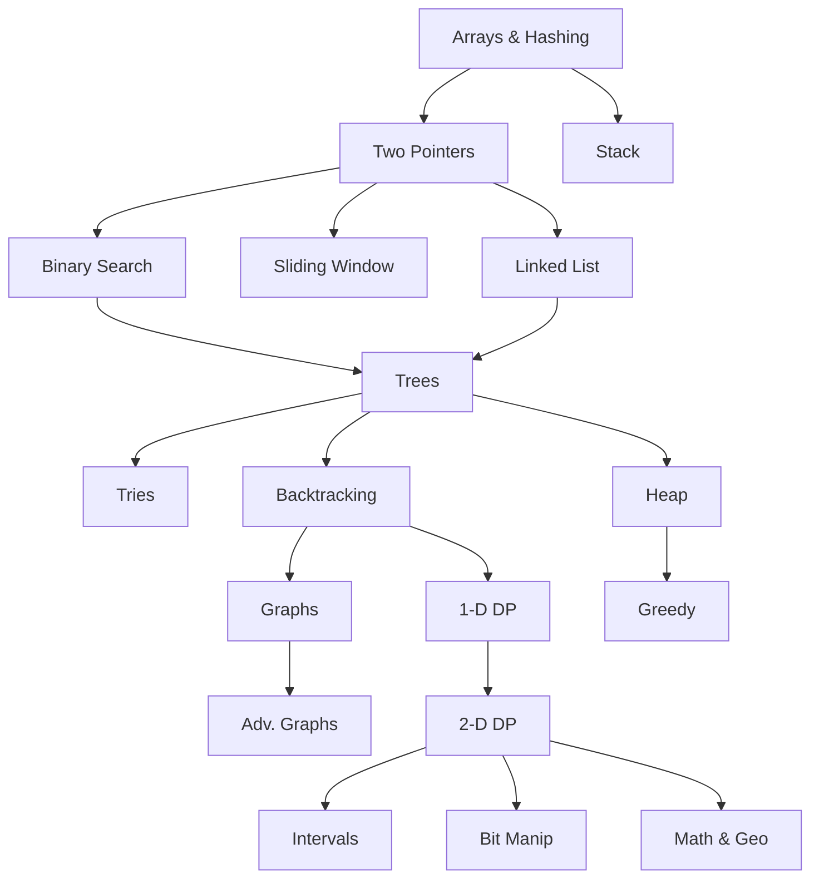

# 🗺️ NeetCode 250 Roadmap

> [!info] How to Use This Roadmap
> This roadmap follows the **NeetCode 250** progression. It bridges the gap for beginners with extra foundational problems before tackling the classic NeetCode 150.
>
> **Click on a topic below to view its problems.**
> Each section tracks its own progress.

## 📊 Progress Overview
**Total Progress**: `16/235` (6%)

---

## 🏗️ Phase 1: The Basics (Foundation)
Essential data structures and patterns to start with.

- [[Roadmap/01-Arrays-Hashing|Arrays & Hashing]] `6/26`
- [[Roadmap/02-Two-Pointers|Two Pointers]] `8/14`
- [[Roadmap/03-Stack|Stack]] `2/14`

## 🎯 Phase 2: Core Algorithms
Fundamental search and traversal techniques.

- [[Roadmap/04-Binary-Search|Binary Search]] `0/14`
- [[Roadmap/05-Sliding-Window|Sliding Window]] `0/9`
- [[Roadmap/06-Linked-List|Linked List]] `0/15`

## 🌳 Phase 3: Tree-Based Structures
Hierarchical data structures and recursion mastery.

- [[Roadmap/07-Trees|Trees]] `0/20`
- [[Roadmap/08-Tries|Tries]] `0/3`
- [[Roadmap/10-Heap-Priority-Queue|Heap / Priority Queue]] `0/12`

## 🧩 Phase 4: Advanced Search & Backtracking
Exploring solution spaces and optimization.

- [[Roadmap/09-Backtracking|Backtracking]] `0/17`
- [[Roadmap/11-Graphs|Graphs]] `0/21`
- [[Roadmap/14-Greedy|Greedy]] `0/10`

## 🚀 Phase 5: Dynamic Programming
Optimization through subproblems.

- [[Roadmap/12-1D-DP|1-D Dynamic Programming]] `0/17`
- [[Roadmap/13-2D-DP|2-D Dynamic Programming]] `0/16`

## 🎓 Phase 6: Specialized Topics
Math, geometry, and bitwise operations.

- [[Roadmap/15-Intervals|Intervals]] `0/7`
- [[Roadmap/16-Math-Geometry|Math & Geometry]] `0/11`
- [[Roadmap/17-Bit-Manipulation|Bit Manipulation]] `0/9`

---

## 🗺️ Visual Progression

